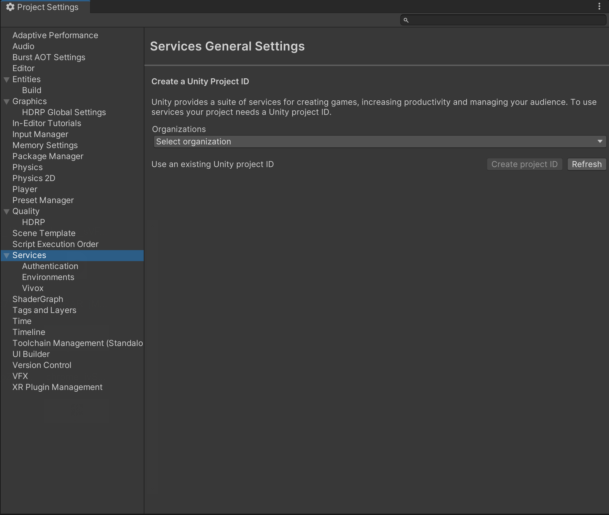
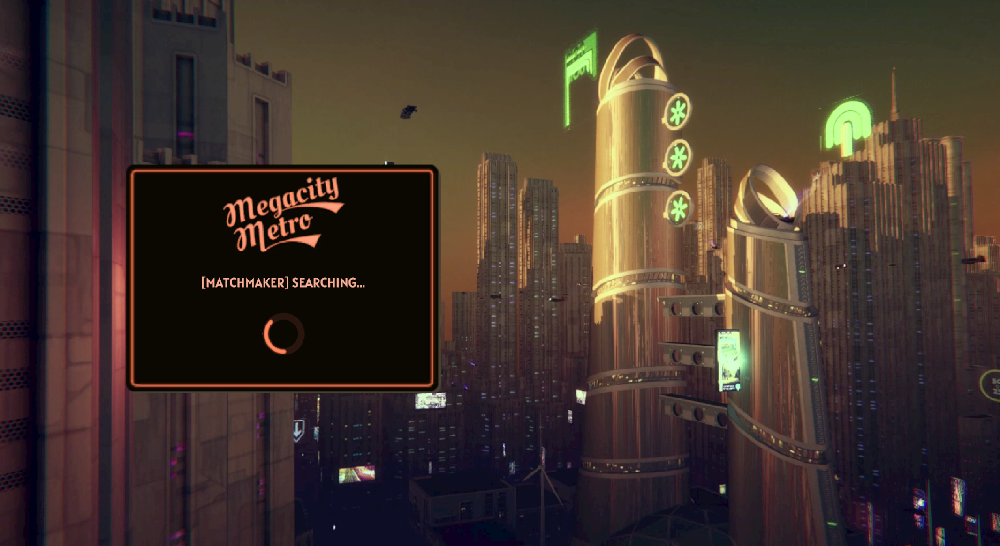

## Contents and Quick Links

- [Game Server Hosting (Multiplay)](#game-server-hosting-multiplay)
- [Matchmaker](#matchmaker)
- [Vivox](#vivox)

## Add Unity Gaming Services (UGS)

Megacity-Metro uses several services from UGS to facilitate connectivity between players. To use these services inside your project, you need a [Unity Account](https://docs.unity.com/ugs-overview/en/manual/creating-unity-ids) and [create an organization](https://support.unity.com/hc/en-us/articles/208592876-How-do-I-create-a-new-Organization-) within the Unity Dashboard.

You can still use Megacity-Metro without UGS, but for a better multiplayer experience, it is recommended to use the following services:

### Game Server Hosting (Multiplay)

**Game Server Hosting - Default (Recommended)**

**Prerequisite**: You must have linked your organization's account.

Using the [Deployment](https://docs.unity3d.com/Packages/com.unity.services.deployment@1.0/manual/index.html) package and the configuration file (`multiplay_config`) previously established in the `Settings/UGS` folder, configure and upload the Game Server Hosting to your Unity Game Services account requires just a few clicks.
- Ensure you have the platform set to `Dedicated Server` and set to Linux.
- Navigate to `Services > Deployment`.
- By using the Deployment Window, select the following in order according to the `Type` and press `Deploy Selected`:
  - Build Configuration
  - Fleet
  - Build

Once all three are marked as `Deployed` and green, you can begin configuring MatchMaking in the cloud using the Dashboard. 
Use the Deployment window to update the server if any changes have been made.
For a custom setup please go to [GSH Custom](gsh.md), otherwise go directly to [Matchmaker](#matchmaker) section.

### Matchmaker

**Matchmaker** is a versatile tool that enables you to customize matches in your game. It offers fast and efficient matches, multi-region orchestration, and backfill options. With its flexible configuration, dynamic scalability, and robust rule engine, Matchmaker simplifies matchmaking while supporting complex game loops. For more information, consult the [Matchmaker Quick Start Guide](https://docs.unity.com/matchmaker/en/manual/matchmaker-quick-start).

To use Matchmaker in your project, you must **Enable** and **Integrate** the Matchmaker service from the [Unity Cloud](https://cloud.unity.com/home).

For Megacity-Metro, we use the following Matchmaker configuration:

Creating the [queue](https://docs.unity.com/matchmaker/en/manual/advanced-topics-queues-pools#Queues):
- **Maximum players on a ticket**: 12

Creating a default [pool](https://docs.unity.com/matchmaker/en/manual/advanced-topics-queues-pools#Pools):
- **Timeout**: 60 seconds

For Matchmaker [rules](https://docs.unity.com/matchmaker/manual/matchmaking-rules-rules), we use the following configuration:
- **Backfill enabled**: true 
- **Team count min**: 1
- **Team count max**: 1
- **Player count min**: 200
- **Player count max**: 200
- **Relaxation 1**: 
  - **Range Control** : Replace min 
  - **Ticket age tyep** : Oldest
  - **Replacement value** : 1
  - **At seconds** : 10

After configuring the services on the dashboard website, navigate to **Edit > Project Settings > Service** and choose your organization and project ID.

Next, click on the play button to initiate the game. To access the Matchmaking services, navigate to the main menu and select **"Matchmake"** mode, followed by clicking the **"Find Match"** button.

Once the "Find Match" button is clicked, the Matchmaking services will initiate the connection process with the server. During this time, a circular loading indicator will be presented to signify that the system is in the process of establishing the connection. Once the connection is established, you will be able to start gameplay.

### Vivox

**Vivox** is a voice chat service that enables players to communicate with each other in-game. To use [Vivox](https://unity.com/products/vivox), you need to connect your project to Vivox from the Unity Editor and enable Vivox in the [Unity Cloud](https://cloud.unity.com/home).

For more information about Vivox, and how to use it you can read the [Vivox quickstart guide](https://docs.vivox.com/v5/general/unity/15_1_200000/en-us/Default.htm#Unity/vivox-unity-first-steps.htm).